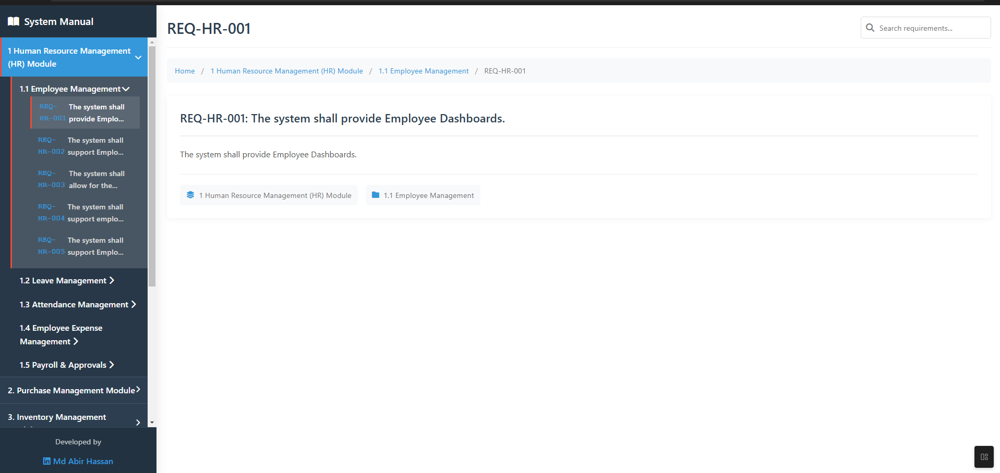

# System Requirements Manual

A comprehensive web application for managing and viewing system requirements documentation.

## Features

- **Organized Navigation**: Hierarchical sidebar with modules, submodules, and requirements
- **Search Functionality**: Real-time search across all requirements
- **Responsive Design**: Works on desktop, tablet, and mobile devices
- **Professional UI**: Clean, modern interface with smooth animations
- **Developer Credit**: Includes developer information with LinkedIn link

## Structure
system-requirements-manual/
├── index.html
├── css/
│ ├── style.css
│ └── responsive.css
├── js/
│ ├── app.js
│ ├── data.js
│ └── search.js
├── assets/
│ ├── images/
│ └── icons/
└── README.md

